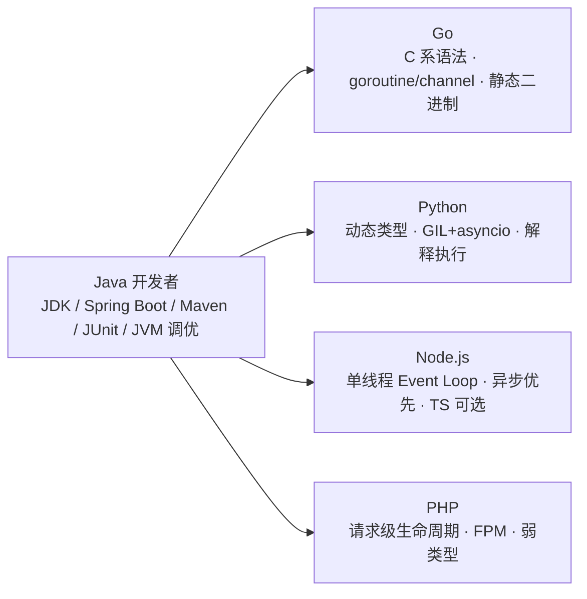

# 01 · 学习路径总图

> 验证环境:纯文档,无依赖。

## 迁移心智模型总览

## 共性学习顺序(每门语言通用)

| 阶段 | 时长 | 内容 | 对应模块 |
|---|---|---|---|
| 1 环境 | 0.5–1 天 | 安装、包管理、构建、IDE/调试 | 语言 README |
| 2 语法 | 2–3 天 | 语法逐项对照 + 数据结构 | 02、03 |
| 3 心智模型 | 1–2 天 | 并发与 IO 的差异(最重要) | 04、05 + topics/ |
| 4 工程化 | 2–3 天 | 测试、生产框架 | 06、07 |
| 5 生产 | 2–3 天 | 部署、监控、排查 | 08、09 |
| 6 实战 | 2–3 天 | examples/ 订单服务对照 + 自己改一版 | examples/ |

**合计约 10 天可达到「能写、能测、能部署」的生产级上手。**

## 各语言差异化要点

| 语言 | 与 Java 最大的心智差异 | 最容易踩的坑 |
|---|---|---|
| Go | 并发模型:goroutine/channel 协作式,而非线程+锁对抗式 | 用 Java 的线程池/阻塞思维写 goroutine;错误处理仍在用异常思维 |
| Python | 动态类型 + GIL + asyncio 三套并发并存 | 用 Java 的接口/泛型思维;并发场景选错模型(线程 vs asyncio vs 进程) |
| Node.js | 单线程 Event Loop,一切皆异步 | 阻塞事件循环;异步错误被吞;回调地狱/未 await |
| PHP | 请求级生命周期:进程不常驻,无应用级内存共享 | 用 Java 常驻内存思维设计 PHP(连接复用、内存缓存、状态) |

## 推荐学习顺序(四门都学时)

1. **Go** — 语法贴近 C 系,并发/内存模型与 Java 差异清晰,对照价值最大;且静态二进制部署形态与 Java 反差明显。
2. **Node.js** — 异步心智模型差异大,学会后对「事件驱动」理解上一个台阶。
3. **Python** — 动态类型与 Java 强类型思维的反差,AI/数据生态的入口。
4. **PHP** — 生命周期模型差异,用于理解存量 Web 系统与历史包袱。

## 单一目标语言速查

| 目标 | 最快路径 |
|---|---|
| 1 周内能写生产代码 | 目标语言 `11-学习路径.md` + 03/04/07 模块 |
| 给现有系统做技术选型 | `02-语言全景对比.md` + topics/ 八张表 |
| 面试准备「多语言经验」 | 04(并发)+ 07(框架)+ 08(部署)三模块精读 |
